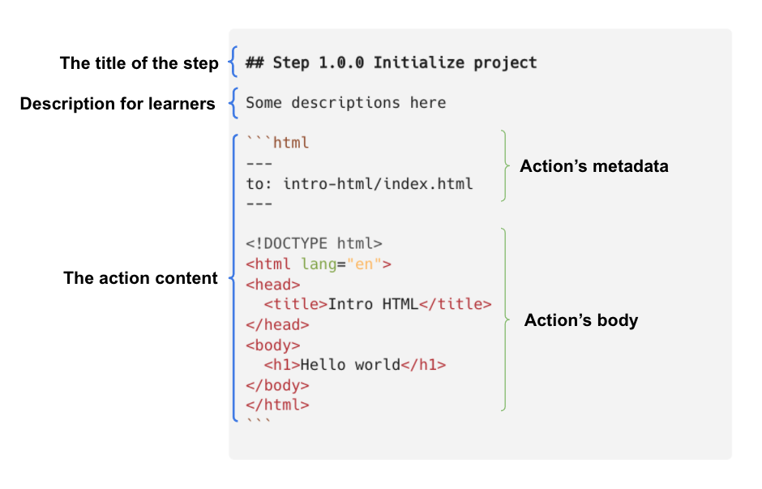

# CoderSchool's Lab generation tool

This library is used to generate step-by-step lab assignments of CoderSchool's courses.

## Installation

To install the package, create a `.npmrc` file in your current working folder:

```
@coderschool:registry=https://npm.pkg.github.com
```

Then on the terminal:

```bash
npm i @coderschool/cs-lab-gen
```

That's it.

## Bootstrapping the project

After completing the instructions, have a `./docs` folder that contains markdown files in different sub-folders. You can run:

```bash
labgen ./docs
```

`labgen` takes the first parameters as the path to the document folder (in this case, `./docs`) and finds all markdown files recursively inside it.

Then `labgen` will extract a list of steps from the markdown files. A step is defined as markdown text with the following form:



- The title must be a markdown title (defined by 1 to 6 hashtags `#`), and start with the word **step** (case insensitive). **The steps will be sorted by the titles**, so the step order should follow right after the word step, e.g. 1.1, 1.2, 1.0.1, 1.0.2, etc.

- The description is for learners to understand the step and optional to `labgen`.

- The action content is the main thing `labgen` cares about. The action should start with the markdown code block \```. It contains two main parts:

  - The metadata is defined by two `---` lines (markdown-like [frontmatter](https://www.npmjs.com/package/front-matter)). It describes the action behavior like creating a new file, injecting to a file, running a shell command, etc.
  - The body is whatever below the metadata. It defines the code to add/inject to a file. The body is ignored if running a shell command or removing lines from a file.

- **A step can have many actions**
